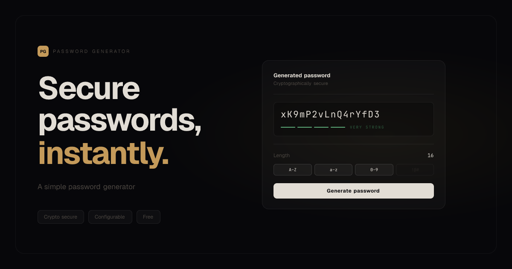

<p align="center">
  
</p>

<div align="center">

# Password Generator

Generate cryptographically secure passwords with custom length and character types, right in your browser — free and open source

</div>

## Stack

- [React](https://react.dev)
- [Vite](https://vite.dev)
- [shadcn/ui](https://ui.shadcn.com)
- [Tailwind CSS](https://tailwindcss.com)

## Getting started

```bash
bun install
bun dev
```

## Features

- Cryptographically secure (`crypto.getRandomValues`)
- Configurable length (6–64 characters)
- Character types: uppercase, lowercase, numbers, symbols
- Exclude ambiguous characters (0, O, l, 1, I)
